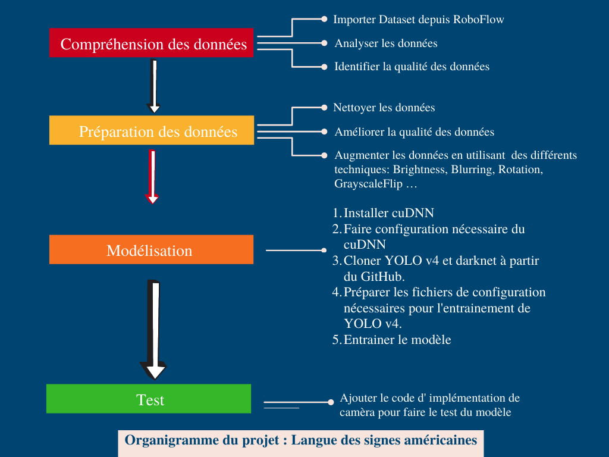

# American_Sign_Language

_Une solution pour aider les personnes sourdes à communiquer en utilisant la langue de signes en la traduisant en langue améicaine grace à computer vision _
#

- Chaima Beldi
- Mariem Mnasser
## Solution
L’objectif de ce travail est de développer un modèle permettant de reconnaître les gestes et les actions du langage des signes. 
Cette solution aident les personnes sourdes et muettes de communiquer facilement avec même ceux qui ne comprennent pas le langage des signes.
Notre solution est divisée en deux étapes:
- Détection en temps réel de geste.
- Interprétation de geste de main en retournant la lettre équivalente.
##
## Technologies
- Colab
- Keras
- CUDA
- Tensorflow
- Python
## Pipeline

## Code
Voir le code de modèle développé dans les deux notebooks nommées  "Data_augmentation_Americain_Sign_Language" & "Langue des signes américaines".

## Démo 
Voir la vidéo nommé "Démo".
